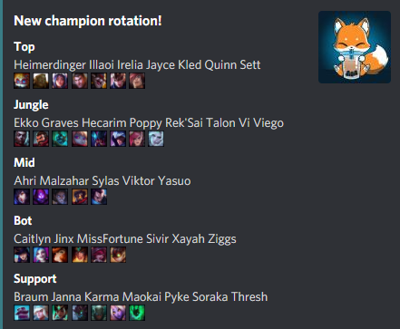
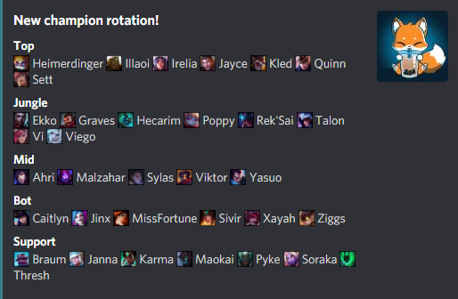
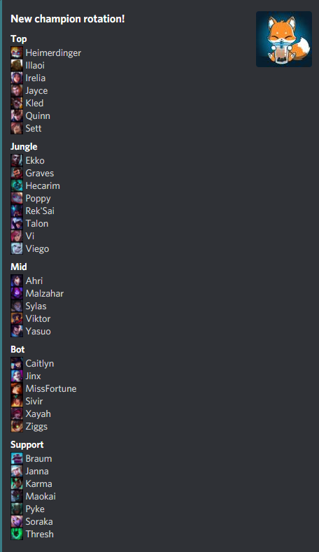
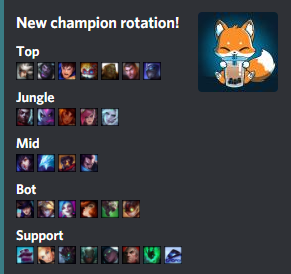

# LeagueOfDravenBot
This queries the Riot Game's API to get the current free champion rotation, then sends it to a discord server (in Kotlin ❤)

## Configuration

Configure [these](src/main/kotlin/me/l3n/bot/discord/model/Config.kt) _(the ones without default are required)_ in (by priority):
  - Event: the json that is provided when executing the function
  - Environment variables: `Variables` of `template.yaml` or in configuration.
    - Prepend the variable name inside in `Config` like so `name__config`, example: `bot__mentionEveryone`.

### Message styles

Click here to view

_EmojisOnOwnLine_

_SameLine_

_SeparateLines_

_EmojisOnly_

# Local run

Copy template-sample.yaml to template.yaml and fill it.

Build: `sam build`

Run: `sam local invoke "LeagueOfDraven-Bot-Kotlin" -e sample-event.json`

Or the `runLambdaLocally` task.

# Deploy

Copy template-sample.yaml to **template-prod.yaml** and fill it.

Build: `sam build`

Deploy: `sam deploy --guided`

After the first deploy, the guided arg can be ommited.
Or the `deployLambda` task can be used.
